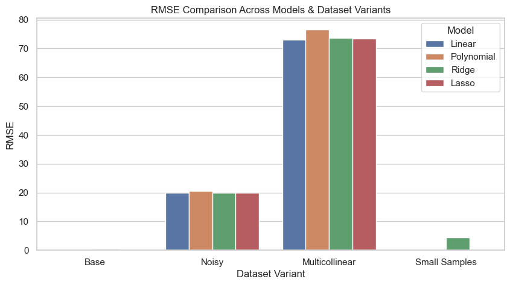
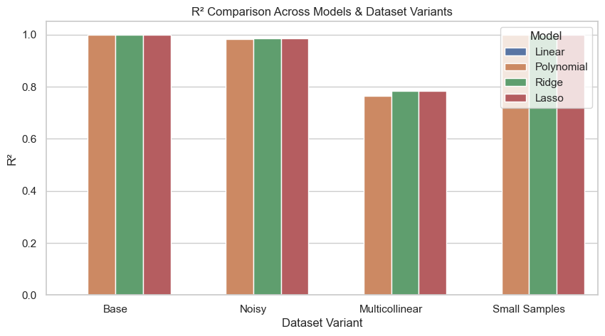

# Regression Under Stress
``` 
This project explores how different regression models behave under stress conditions like noise, multicollinearity, and small datasets.  
Linear, Polynomial, Ridge, and Lasso regressions are tested to reveal their strengths and weaknesses in real-world-like scenarios.  
Results show when simplicity wins, when complexity backfires, and how regularization can stabilize predictions, giving clear guidance for model selection.
```

A controlled experiment demonstrating how different regression models behave under various stress conditions like noise, multicollinearity, and small sample sizes.

---

## 🔹 Motivation

In real-world regression problems, choosing a model isn’t just about getting the best fit. Different datasets can expose weaknesses in each approach:  
- Noise in the target can mislead complex models.  
- Multicollinearity can destabilize coefficients.  
- Small datasets can make even simple models overfit.  

This project explores **Linear, Polynomial, Ridge, and Lasso regressions** under these scenarios, highlighting when each model works — and when it doesn’t.

---

## 🔹 Dataset

We use a **synthetic dataset** generated to keep everything controlled and reproducible:

- **Base dataset:** 500 samples, 6 numerical features, 1 target.  
- **Variants created:**  
  1. **Noisy target** – Gaussian noise added.  
  2. **Multicollinear features** – some features linearly correlated.  
  3. **Small sample regime** – downsampled to 50 rows.

> This setup allows us to clearly observe model behavior without messy real-world data.

---

## 🔹 Models & Experiments

| Model | Key Notes |
|-------|-----------|
| Linear Regression | Baseline, simple, interpretable |
| Polynomial Regression (degree=2) | Adds complexity, can overfit |
| Ridge Regression (alpha=1.0) | Regularizes coefficients, helps multicollinearity |
| Lasso Regression (alpha=0.1) | Promotes sparsity, mild regularization |

**Metrics evaluated:** RMSE and R² on test sets for all dataset variants.

---

## 🔹 Key Observations

- **Linear Regression:** Handles clean and small-sample data well, fails under multicollinearity.  
- **Polynomial Regression:** Slightly overfits noisy data and worsens multicollinearity issues.  
- **Ridge Regression:** Mitigates multicollinearity, keeps coefficients stable.  
- **Lasso Regression:** Shrinks coefficients, promotes sparsity, performance similar to Ridge in this setup.  

---

## 🔹 Visual Insights

### RMSE Comparison



### R² Comparison



> These plots make it clear which models are robust to which stress conditions at a glance.

---

## 🔹 How to Run

1. Clone the repo:  
```bash
git clone https://github.com/perceptroncipher/regression-under-stress.git

2. Install dependencies:
pip install -r requirements.txt

3. Open and run the notebook:
notebooks/01_regression_under_stress.ipynb

4. Observe outputs and plots.
```

```
Future work could include:
- ElasticNet regression for hybrid regularization
- Applying the experiment to real-world datasets
- Adding automated feature importance analysis
```

🔹 Contact

If you want to reach out for collaboration, questions, or feedback:

Name: Ibrahim Boluwatife Adeyemi

Email: adeyemiboluwatife.olayinka@gmail.com

GitHub: github.com/perceptroncipher

